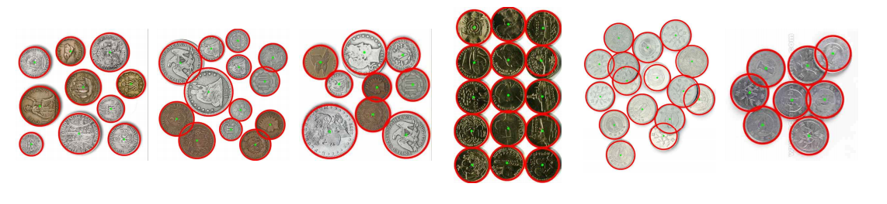

# Coin Detection using OpenCV

This project is a simple program to detect and count coins in images using OpenCV. It uses the Hough Circle Transform to identify circular objects, such as coins, and draws them on the original images.

## Features
- **Grayscale Conversion & Gaussian Blur**: Preprocesses images to enhance the accuracy of circle detection.
- **Hough Circle Transform**: Identifies circular shapes, calculates their centers and radii, and draws them on the image.
- **Batch Processing**: Supports processing multiple images in a single run.
- **Output Visualization**: Annotated images are saved and displayed with detected circles.

---

## Sample Output
Here��s an example of the detected coins:



*Detected circles are marked in red with green centers.*

---

## How to Run

### Prerequisites
- Visual Studio 2022 (or later)
- OpenCV library (version 4.10 or higher)

### Build Instructions
1. Clone the repository:
    ```bash
    git clone https://github.com/your-username/coin-detection.git
    cd coin-detection
    ```
2. Open the project in Visual Studio 2022.
3. Make sure the OpenCV library is linked correctly in the project settings.
4. Build and run the project.

### Running the Program
To run the program, ensure you have your input images (`coins0.jpg`, `coins1.jpg`, etc.) in the project directory.

```bash
coin_detector.exe
